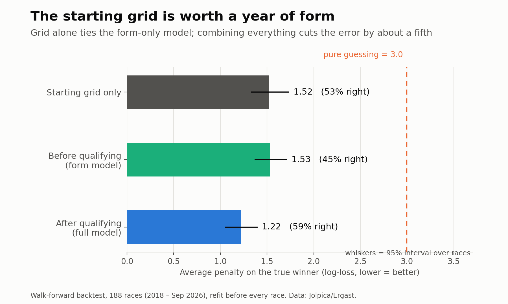
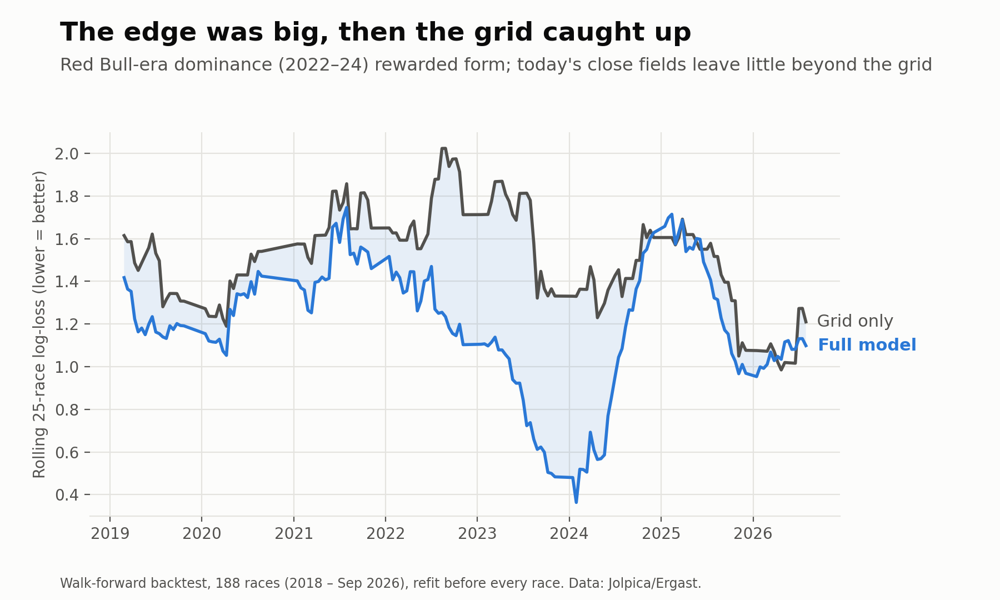
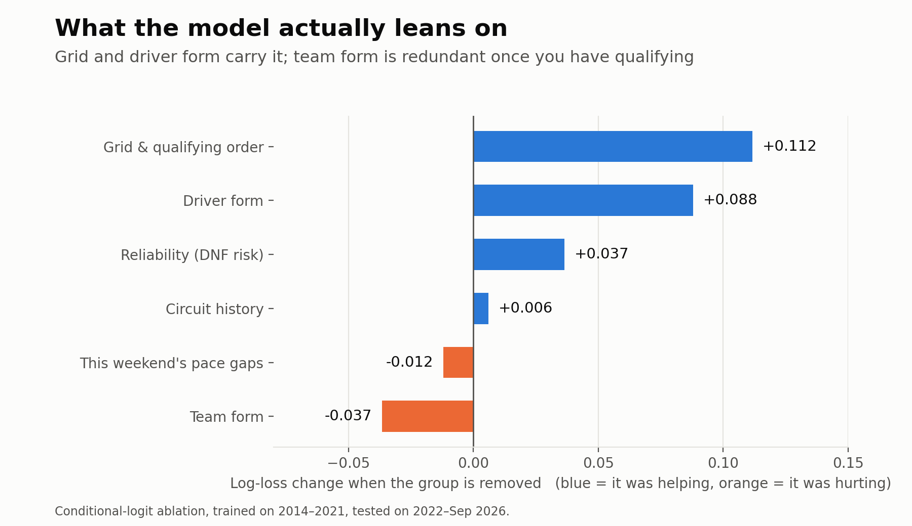

# F1 Winner Predictor

**Calibrated, backtested probabilities for who wins a Formula 1 Grand Prix, and an honest account of how much anyone can know.**



## The short version

I tested whether a model can beat the obvious bet ("pole-sitter wins") over **188 real races (2018 to Sep 2026)**, refitting before every race so nothing ever sees the future.

| | Winner log-loss ↓ | Top-1 | Top-3 |
|---|---|---|---|
| Pure guessing (20 drivers) | 3.00 | 5% | 15% |
| Pole-sitter / starting grid only | 1.52 | 53% | 87% |
| **Before qualifying** (form only) | 1.53 | 45% | 77% |
| **After qualifying** (full model) | **1.22** | **59%** | **90%** |

What survives scrutiny:

- **The probabilities are good.** Paired against the grid-only model, the full model improves log-loss by **0.30 nats/race (95% CI 0.14 to 0.47)**. Calibration is close to the diagonal ([figure](reports/figures/03_calibration.png)).
- **The accuracy edge over "pole wins" is *not* statistically significant** (59% vs 53%, intervals overlap). Don't read it as "the model picks winners better than the grid does".
- **The edge is era-dependent.** It was large while one team dominated (+0.42 nats/race, 2018–23) and **unproven in 2024–26** (+0.06, CI −0.20 to +0.36, 63 races). When the field is close, the grid already tells you almost everything ([figure](reports/figures/02_edge_over_time.png)).
- **Before qualifying, form alone is no better than knowing the grid** and collapses under regulation resets (2026: 3 of 15 right).



## Final model and decisions

**Use for race week: the post-qualifying winner-probability ensemble** (conditional logit + LightGBM + neural net, temperature-calibrated), trained on 2016-2024 and tested on the unseen 2025 season: **0.946 log-loss vs 1.111 for the grid** (paired +0.166 nats/race, 95% CI +0.042 to +0.283; 62% top-1 vs 67% for pole, so the gain is in probability quality, not in naming the winner). Details: [`reports/final_model_findings.md`](reports/final_model_findings.md). `python scripts/predict_next.py --refresh` freezes the prediction for the next race (never overwrites an existing frozen file).

**Tried and not adopted** (each tested with the same walk-forward / unseen-season rules, none held up): sequence nets and Llama 3.1 8B ([`llm_findings.md`](reports/llm_findings.md)), a lap-by-lap race simulator v1 and v2 reactive-strategy ([`sim_v2_findings.md`](reports/sim_v2_findings.md)), extra feature groups ([`feature_search_findings.md`](reports/feature_search_findings.md)), trees / Plackett-Luce / Elo / chaos split ([`v3_findings.md`](reports/v3_findings.md)), and a whole-finishing-order model: it ties "finish where you start" (Spearman ~0.66 vs 0.65, exact position ~14-17% vs 15-18%; [`position_findings.md`](reports/position_findings.md)). Before qualifying the model is unreliable (21% top-1 in 2025) and should not be used.

**Live scorecard.** Race 16 (Bahrain GP in Malaysia, 4 Oct 2026): frozen pre-race call gave Verstappen 67% (top pick); he won from pole. Log-loss 0.397 (random guessing: 3.0). One race says little about a probabilistic model; see [`predictions/`](predictions/) for every frozen call and its scored result.

## Try it: interactive demo

```bash
pip install fastapi uvicorn
python -m uvicorn app.server:app --port 8000     # then open http://localhost:8000
```

Pick any of the 268 races (188 with honest walk-forward calls), see the probabilities next to the real winner, view the frozen pre-race call, and edit the starting grid to see what a slot is worth. Grid what-ifs use a model trained on all completed races, so for past races they are illustrative, not out-of-sample.

## Forward predictions

`scripts/predict_next.py` trains on every completed race, scores the next one, and freezes a timestamped JSON (with git commit) into [`predictions/`](predictions/) **before the race**. Those files are the audit trail: the repo records the call, then the result.

## What was wrong with v1 (and why this exists)

The first version (2025, kept in [`legacy/`](legacy/)) reported **95.7% accuracy**. That number was meaningless: predicting *"nobody wins"* scores 95.0%, because only 1 in 20 driver-rows is a winner. The audit that led to v2 found:

- `driver_dnf_rate` was **always zero**: it searched for the string "DNF", which never appears in the data (statuses are `Retired`, `Collision`, `Engine`...).
- The Transformer trained on **NaN loss** for every epoch and reported accuracy from garbage weights.
- Random train/test splits over **overlapping 5-race windows** (leakage), early stopping on the test set, and prediction-time grid positions filled with a driver's *historical average*.
- Only 183 races, 36 of them in the test set, with no baseline comparison.

## What v2 does differently

| | v1 | v2 |
|---|---|---|
| Framing | 20 independent yes/no problems | one softmax over the field per race |
| Evaluation | random split, accuracy | walk-forward refit before every race; log-loss, Brier, top-k, paired bootstrap CIs |
| Baselines | none | uniform, pole, grid-only logit |
| Data | 183 races ending mid-2025 | 2014–2026, results + qualifying + sprints (267 races) |
| Leakage guard | none | 4 tests, including *shuffling a race's own result and checking its features don't move* |
| Models | XGBoost, MLP, (broken) Transformer | conditional logit + LightGBM, ensembled; temperature calibration tested |
| Reproducible | notebooks | `./run_all.sh` |

### Do sequence models help? (pre-registered check)

v1 claimed a Transformer; its loss was NaN, so it proved nothing. I re-ran the idea properly on the same 188 races: GRU and Transformer encoders over each driver's last 10 races, softmax across the field, early stopping on *training* races only, 3 seeds, protocol fixed in advance ([details](reports/seq_experiment.md)).

| vs the tabular ensemble (nats/race, + = sequence better) | all 188 races | 2024-26 |
|---|---|---|
| GRU + qualifying | -0.036 [-0.111, +0.042] | +0.063 [-0.059, +0.193] |
| GRU + qualifying + form features | -0.041 [-0.101, +0.021] | -0.008 [-0.079, +0.069] |
| Transformer + qualifying | **-0.104 [-0.174, -0.033]** | -0.088 [-0.217, +0.043] |

The GRUs tie the tabular ensemble; the Transformer is significantly worse. All three beat grid-only, so the history carries real signal, just no more than the hand-built features. Caveat: sequence models were refit every 8 races (compute), the tabular models every race, which slightly favours the tabular side.

## What didn't help (and why that is a finding)

After the core model, I tried everything a domain checklist suggests. Each test used the same walk-forward protocol, with the metric chosen on dev (2018-23) and the 2024-26 holdout checked once. Full tables: [`reports/feature_search_findings.md`](reports/feature_search_findings.md).

| Idea | Result vs current model |
|---|---|
| Race-pace history from 188 races of lap data | tie (-0.005 dev, -0.010 holdout nats/race) |
| Circuit geometry and history (twistiness, straights, altitude, corners, overtaking, safety-car and DNF rates) | tie (-0.001 dev, +0.001 holdout) |
| Driver experience, championship standing, teammate gap | tie / slightly worse |
| Tyre-management proxy | tie dev, slightly worse holdout |
| Practice pace (FP2/FP1) | **significantly worse on dev** (-0.064), tie on holdout |
| Race-day weather | tie (and optimistic: it uses actual, not forecast, weather) |
| Lap-by-lap Monte Carlo race simulator ([details](reports/sim_findings.md)) | ties grid-only, **significantly worse** than the tabular model |

The starting grid already carries most of this weekend's pace information, and about 190 scored races cannot teach the model small extra effects. The simulator's pace model *is* good (race-pace error 35% below qualifying alone), but independent pit-strategy randomness washes out the grid advantage (simulated pole wins 28% vs 57% in reality); fixing it needs reactive strategy modelling.

### Versus a betting market

I pulled Polymarket's race-winner price history (public API, no account) and compared the last pre-lights-out price with the model on the same races ([`reports/odds_findings.md`](reports/odds_findings.md)).

| 17 races, 2025 | log-loss | top-1 |
|---|---|---|
| Grid only | 1.075 | 71% |
| Model | 0.934 | 65% |
| Market | 0.961 | 53% |
| 50/50 blend | 0.910 | 65% |

Model vs market: -0.027 nats/race [-0.19, +0.14], a **tie**. The 17-race sample can only detect a large gap, so read this as "not clearly worse than a market", not "beats the market".

## What the model uses



Ablation (train 2014–21, test 2022–26): grid and driver form carry the model. Team form is redundant once qualifying is known, and removing it slightly *improves* the logit. I reported this rather than retuning on it.

## Honest limitations

- **Thin odds benchmark.** I compared against Polymarket prices on 17 races (2025 only). Sharp bookmaker lines and longer history were not available, so "ties the market" is weakly supported.
- **Small samples.** 188 scored races; the 2024–26 holdout is 63 races and 2026 is 15. Intervals are wide on purpose.
- **Calibration at the top end runs slightly hot** (82% predicted, 75% observed, n=57), so treat 70%+ calls with care.
- **Tested and found not to help:** practice pace, weather, tyre proxies, circuit geometry, race-pace history, a race simulator (see above). **Not available:** compound-level tyre data per car, DRS-zone counts, post-qualifying penalties for future races (qualifying order is used as the grid until it is official).
- **Selection discipline:** I added one family of features (this weekend's team pace, faster constructor form) after seeing early results, developing on 2018–23 only. It changed nothing (log-loss 1.170 vs 1.169 on dev; 1.321 vs 1.318 on holdout). Both are reported.
- **2026 is a regulation reset.** Features that lean on car history are discounted at season starts (`RESET_SEASONS`), but 15 races is too few to judge.

## Run it

```bash
pip install -r requirements.txt
./run_all.sh            # ingest -> tests -> backtest -> figures -> next-race prediction
```

Or step by step:

```bash
cd src && python -m f1pred.ingest 2014 2026   # cached Jolpica pulls (~15 min first time)
python -m pytest tests -q
python scripts/run_backtest.py                # writes reports/backtest_scores.csv, metrics_*.csv
python scripts/holdout_report.py              # dev (2018-23) vs holdout (2024-26)
python scripts/make_figures.py
python scripts/predict_next.py --refresh      # after qualifying, before the race
```

## Layout

```
src/f1pred/    ingest.py  features.py  models.py  backtest.py
scripts/       run_backtest.py  holdout_report.py  make_figures.py  predict_next.py
tests/         test_leakage.py
predictions/   frozen pre-race predictions (the audit trail)
reports/       backtest scores, metrics tables, figures
app/           FastAPI + single-page demo UI
reports/       ... plus feature_search_findings.md, sim_findings.md, odds_findings.md, seq_experiment.md
articles/      Substack essay + LinkedIn post
legacy/        v1 notebooks and data (kept on purpose)
```

## Data and licence

Race data from the [Jolpica](https://github.com/jolpica/jolpica-f1) Ergast-compatible API. Code is MIT-licensed. For education and research; not betting advice.
