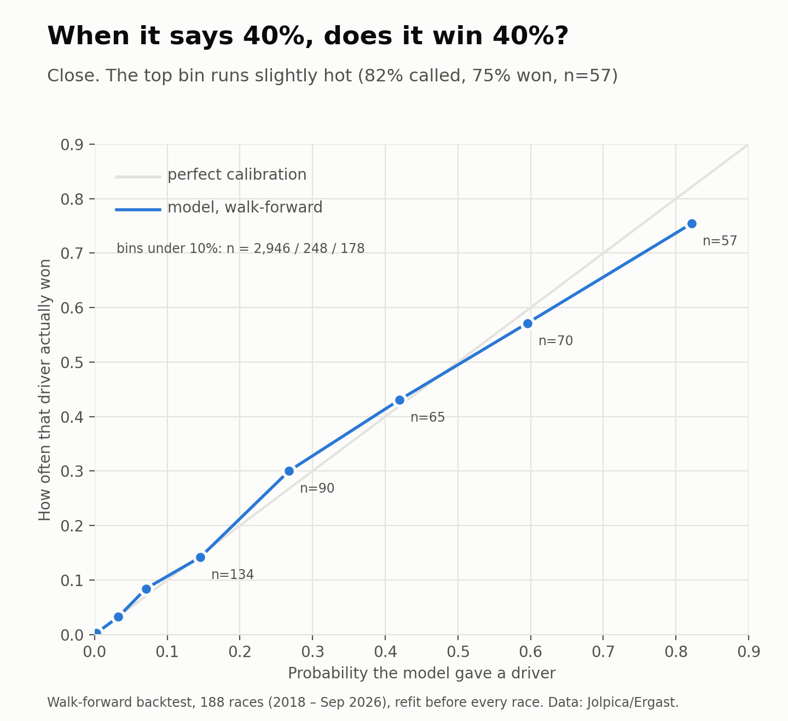

# My F1 model was 95.7% accurate. It was also useless.

*A year later, I audited my own machine-learning project, rebuilt it, and found out how much anyone can actually know about who wins a Grand Prix.*

---

In 2025 I built a Formula 1 winner predictor. XGBoost, a neural net, even a Transformer. The notebook printed **95.7% accuracy**, and I felt great about it.

This year I went back and read it properly. The number was meaningless.

Only one driver in twenty wins a race. A model that says **"nobody wins, ever"** scores **95.0%** on that data. My 95.7% was a rounding error above a model that does nothing.

That was the start of the audit. It got worse before it got better:

- A feature called `driver_dnf_rate` was **always zero**. I was searching for the text "DNF" in a column whose values are "Retired", "Collision" and "Engine".
- My Transformer's loss was **NaN in every epoch**. The accuracy I reported came from garbage weights.
- I had split train and test **randomly**, over overlapping five-race windows, so the model was effectively looking at the future.
- I had no baseline at all. I never asked: *what would a lazy guess score?*

So I rebuilt it, this time trying to prove myself wrong instead of impressive.

## The bar: "pole position wins"

Over the 188 races I could test (2018 to September 2026), the pole-sitter won **53%** of the time. That's the number to beat. Any model that can't beat "pick whoever starts first" isn't predicting anything.

## The rules I gave myself

1. **Walk-forward testing.** Before every single race, retrain using only races that already happened. No shuffling, ever.
2. **Probabilities, not picks.** A race has exactly one winner, so the model outputs a probability for each driver and they sum to 100%. I judge it on *log-loss*: how much probability it put on the driver who actually won.
3. **Leak tests.** My favourite: shuffle a race's own finishing order, rebuild the features, and assert that nothing about that race's features changed. If it fails, the model can see the answer. (It passes.)
4. **Say what I tried.** If I change something after seeing results, I disclose it.

## What I found

Three things stood out.

**1. Before qualifying, a year of form is worth about as much as knowing the grid.** Both land at a log-loss of about 1.5, versus 3.0 for random guessing. Everything a model learns from past results is roughly what Saturday's qualifying hands you for free.

**2. After qualifying, combining everything helps, and it's real.** Log-loss drops to **1.22**. Compared head-to-head with the grid-only model across all 188 races, it's better by **0.30 nats per race, with a 95% interval of 0.14 to 0.47**. That excludes zero.

**3. The accuracy gain over "pole wins" is not significant.** 59% versus 53%, with overlapping intervals. I want to be careful here: what the model improves is the *quality of its probabilities*, not its ability to name the winner.

## The finding I didn't expect

When I split the results by era, the story changed.

From 2018 to 2023, with Mercedes and then Red Bull dominating, the model beat the grid-only baseline by a wide margin. Form matters when one car is far ahead.

From 2024 to 2026, the edge **shrinks to something I cannot distinguish from zero** (+0.06 nats/race, interval −0.20 to +0.36, across 63 races). In a close field, qualifying already contains nearly everything there is to know.

I didn't go looking for that. A model that "works" can quietly be working only because the sport was easy to predict. The next time you see an F1 prediction claiming 70% accuracy, ask which seasons it was tested on.

## Does it know what it doesn't know?

Mostly, yes. When the model says 30%, drivers win about 30% of the time. The one soft spot is the top: where it said about 82%, drivers won 75% of the time (57 cases). I'd treat any 70%+ call with some suspicion.

## I threw everything else at it. Nothing helped.

I worked through the checklist every F1 model is supposed to have: circuit geometry (twistiness, straights, altitude, corners), overtaking difficulty, safety-car and DNF history, tyre degradation, practice pace, weather, teammate gaps, championship standing, even a full lap-by-lap race simulator fed by lap data from 188 races.

Same rules as before: walk-forward, metric chosen on the older races, the 2024 to 2026 holdout checked once.

- **Almost everything tied the simple model.** Differences were a few thousandths of a nat, far inside the noise.
- **Practice pace made it significantly worse** on the development races. Short practice sessions are a noisy signal.
- **The simulator's pace model was genuinely good**, predicting race pace 35% better than qualifying alone. But the simulator as a whole lost to the simple model. Its pole-sitters won 28% of races against 57% in reality. Random pit-stop timing was scrambling the order far more than real teams allow, because real teams cover each other. That needs a reactive strategy model, which I didn't build.

The reason is simple: the starting grid already contains most of what this weekend's pace tells you, and about 190 races can't teach a model small extra effects.

## And against a betting market?

Prediction-market prices were the one thing I thought could beat me, since they carry information a model can't see. I pulled Polymarket's public price history (no account, no trades) and compared each race's last price before lights-out with my model's call.

On the 17 clean 2025 races: **my model's log-loss was 0.934; the market's was 0.961.** The difference (0.03 nats per race, interval from about -0.19 to +0.14) is a tie. With 17 races I could only have detected a big gap, so the honest reading is "not clearly worse than a market", not "beats the market".

## What I deliberately left out

- **Sharp bookmaker lines.** Polymarket is a thin exchange, not a bookmaker. Historical bookmaker odds weren't freely available.
- **Compound-level tyre data per car and DRS-zone counts.** I couldn't find clean sources, so the tyre test is a proxy.

## Did the fancy neural nets help?

My v1 had a Transformer, but its loss was NaN, so it proved nothing. This time I tested sequence models properly, with the protocol written down before I ran it: same 188 races, same walk-forward rules, three seeds, no tuning on the test set.

The GRUs **tied** the simple tabular model. The Transformer was **significantly worse** (0.10 nats/race, interval excludes zero). With about 270 races, there isn't enough data for the extra machinery to pay for itself. The history did carry real signal (all three beat the grid-only baseline), just no more than a handful of hand-built features.

## The part where I can be wrong in public

Qualifying for tomorrow's race finished today. The model is frozen and its call is committed to the repository with a timestamp **before lights-out**:

> **Bahrain Grand Prix in Malaysia, 4 Oct 2026.** Verstappen (from pole) 67%, Hamilton 11%, Antonelli 8%, Hadjar 5%.

One race tells you almost nothing about a probabilistic model. A 67% call fails a third of the time. But the file exists and the result will be added right under it, whichever way it goes.

> **Result:** *[fill in after the race: winner, and the probability the model gave them]*

## The takeaway

A year ago I optimised the number that made me look good. This time I optimised for being hard to fool. The model is modest, the edge is smaller than I hoped, and I trust it far more.

Try it live (free hosting, so the first load may take a minute): **[https://f1-winner-predictor.onrender.com/](https://f1-winner-predictor.onrender.com/)**

Code, data pipeline, tests and every figure: **[github.com/divyanshg03/F1-Winner-Prediction](https://github.com/divyanshg03/F1-Winner-Prediction)**. One command (`./run_all.sh`) reproduces everything.

*If you work with models: what's the lazy baseline in your project, and have you actually run it?*
